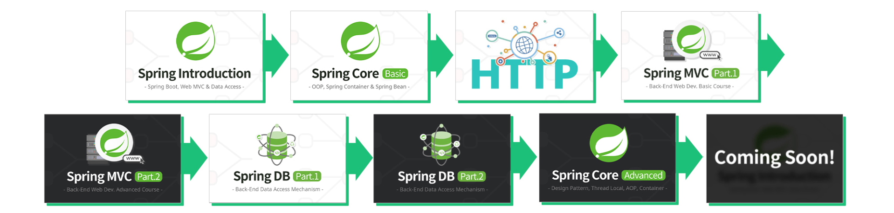

## 🌱 김영한님의 스프링 완전 정복 로드맵 따라가기

---

### 📁 스프링 입문 - 코드로 배우는 스프링 부트, 웹 MVC, DB 접근 기술

#### 🏃‍♂ Started on: 2023-12-19
  - [x] 1일차 - [2023-12-19일] 05:21:00 공부 완료
#### 🏆 Finished  on : 2023-12-19

---

### 📁 스프링 핵심 원리 - 기본편

#### 🏃‍♂ Started on: 2023-12-20
  - [x] ⏱️ 1일차 - [2023-12-20일]  03:13:57.73 공부 완료 [블로그 : 스프링 컨테이너 생성](https://choimung.github.io/spring/%EC%8A%A4%ED%94%84%EB%A7%81-%EC%BB%A8%ED%85%8C%EC%9D%B4%EB%84%88%EC%99%80-%EC%8A%A4%ED%94%84%EB%A7%81-%EB%B9%88/)
  
  - [x] ⏱️ 2일차 - [2023-12-21일] 01:22:33.34 공부 완료 [블로그 : 스프링 컨테이너 빈 조회](https://choimung.github.io/spring/%EC%8A%A4%ED%94%84%EB%A7%81-%EC%BB%A8%ED%85%8C%EC%9D%B4%EB%84%88-%EB%B9%88-%EC%A1%B0%ED%9A%8C/)
      
  - [x] ⏱️ 3일차 - [2023-12-22일] 01:25:.49 공부 완료 [블로그 : 싱글톤 패턴과 스프링 컨테이너](https://choimung.github.io/spring/%EC%8B%B1%EA%B8%80%ED%86%A4-%ED%8C%A8%ED%84%B4%EA%B3%BC-%EC%8A%A4%ED%94%84%EB%A7%81-%EC%BB%A8%ED%85%8C%EC%9D%B4%EB%84%88/)
        
  - [x] ⏱️ 4일차 - [2023-12-23일] 02:06:.02 공부 완료 [블로그 : 작성예정]()

  - [x] ⏱️ 5일차 - [2023-12-24일] 04:04:.34 공부 완료 [블로그 : 공부한 내용 총 정리해서 작성예정]()

#### 🏆 Finished  on : 2023-12-24

---

### 📁 스프링 MVC 1편 - 백엔드 웹 개발 핵심 기술

#### 🏃‍♂ Started on: 2023-12-27
  - [x] ⏱️ 1일차 - [2023-12-27일]  02:47:05.45 공부 완료
      
  - [x] ⏱️ 2일차 - [2023-12-28일]  02:10:39.01 공부 완료

  - [x] ⏱️ 3일차 - [2023-12-29일]  04:23:49.42 공부 완료

  - [x] ⏱️ 4일차 - [2023-12-31일]  04:00:03.22 공부 완료

  - [x] ⏱️ 5일차 - [2024-01-01일]  03:43:32.56 공부 완료

  - [x] ⏱️ 6일차 - [2024-01-04일]  02:32:04.32 공부 완료
#### 🏆 Finished  on : 2024-01-04

---

### 📁 스프링 MVC 2편 - 백엔드 웹 개발 활용 기술

#### 🏃‍♂ Started on: 2024-01-05

  - [x] ⏱️ 1일차 - [2024-01-05일]  02:17:12.21 공부 완료

  - [x] ⏱️ 2일차 - [2024-01-06일]  03:19:19.64 공부 완료

  - [x] ⏱️ 3일차 - [2024-01-07일]  02:22:49.43 공부 완료

  - [x] ⏱️ 4일차 - [2024-01-08일]  03:50:33.88 공부 완료

  - [x] ⏱️ 5일차 - [2024-01-09일]  02:20:13.58 공부 완료
        
  - [x] ⏱️ 6일차 - [2024-01-10일]  02:07:13.48 공부 완료

  - [x] ⏱️ 7일차 - [2024-01-12일]  04:07:55.68 공부 완료

  - [x] ⏱️ 8일차 - [2024-01-14일]  05:22:12.25 공부 완료

#### 🏆 Finished  on : 2024-01-14

---
- [x] 모든 개발자를 위한 HTTP 웹 기본 지식
- [ ] 스프링 DB 1편 - 데이터 접근 핵심 원리
- [ ] 스프링 DB 2편 - 데이터 접근 활용 기술
- [ ] 스프링 핵심 원리 - 고급편
- [ ] 실전! 스프링 부트
